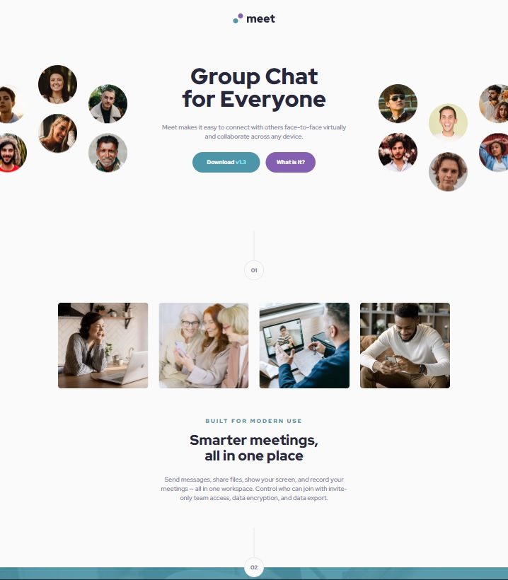

https://krzysztofrozbicki.github.io/fem-challenge-08/

# Frontend Mentor - Meet landing page solution

This is a solution to the
[Meet landing page challenge on Frontend Mentor](https://www.frontendmentor.io/challenges/meet-landing-page-rbTDS6OUR).
Frontend Mentor challenges help you improve your coding skills by building realistic projects.

## Table of contents

- [Overview](#overview)
  - [The challenge](#the-challenge)
  - [Screenshot](#screenshot)
  - [Links](#links)
- [My process](#my-process)
  - [Built with](#built-with)
  - [What I learned](#what-i-learned)
  - [Continued development](#continued-development)
- [Author](#author)
- [Acknowledgments](#acknowledgments)

## Overview

### The challenge

Users should be able to:

- View the optimal layout depending on their device's screen size
- See hover states for interactive elements

### Screenshot

### Links

- [Solution url](https://github.com/KrzysztofRozbicki/fem-challenge-08/)
- [Live site url](https://krzysztofrozbicki.github.io/fem-challenge-08/)

## My process

### Built with

- Semantic HTML5 markup
- CSS custom properties
- Flexbox
- CSS Grid
- Mobile-first workflow

### What I learned

Learned how to use grid, and how to apply the background images that are cropping outside the
viewport.

### Continued development

Would like to work with designer with all responsive designs (e.g. this one is looking great on
1440px, but it is hard to get it working on 1024px with the desktop layout)

## Author

- GitHub - [GitHub](https://github.com/KrzysztofRozbicki)
- Website - [Pogbit](https://www.pogbit.com/)
- Frontend Mentor - [@KrzysztofRozbicki](https://www.frontendmentor.io/profile/KrzysztofRozbicki)

## Acknowledgments

Thank you [GoIt](https://goit.global/pl/) for the great course where in just 12 weeks I have learned
almost full HTML/CSS so i can make these challenges without much struggle!
